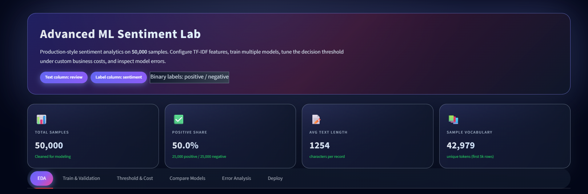
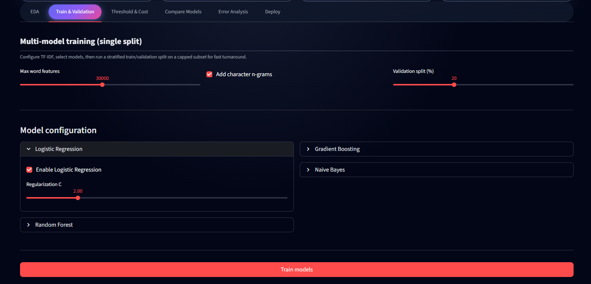
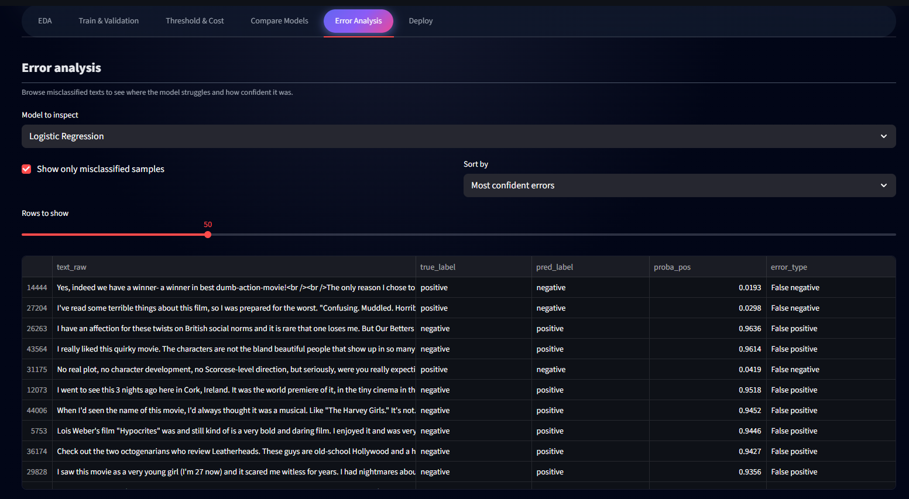
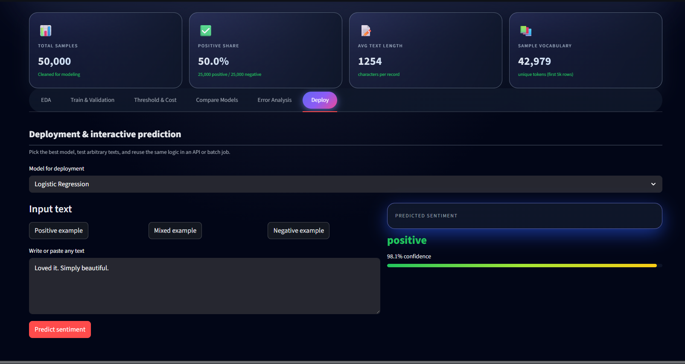

# Advanced ML Sentiment Lab

[](https://github.com/tarekmasryo/advanced-ml-sentiment-lab/actions/workflows/ci.yml)
[](https://streamlit.io/)
[](LICENSE)
[](https://github.com/tarekmasryo)

Interactive **Streamlit + Plotly** dashboard for **binary sentiment analysis** with training, evaluation, threshold tuning, error analysis, and live prediction.

---

## Overview

Give it any CSV with:

- **Text column** (e.g., `review`, `text`, `comment`)
- **Binary label column** (e.g., `sentiment`, `label`)

It will:

- Clean text and build **TF-IDF word n-grams** + optional **character n-grams**
- Train classical models (Logistic Regression, Random Forest, Gradient Boosting, Naive Bayes)
- Evaluate with **ROC-AUC, PR-AUC, F1, Accuracy, Precision, Recall**
- Tune the **decision threshold** with **FP/FN business cost**
- Explore **misclassifications** and run **live predictions** on arbitrary text

Works great with **IMDB 50K Reviews**:  
https://www.kaggle.com/datasets/lakshmi25npathi/imdb-dataset-of-50k-movie-reviews

---

## Dashboard Preview

### EDA & KPIs


### Train & Validation


### Error Analysis


### Deploy & Interactive Prediction


---

## Key Features

### Flexible input
- Upload your own CSV from the sidebar
- Auto-load common filenames if present in the repo:
  - `IMDB Dataset.csv`
  - `imdb.csv`
  - `reviews.csv`
  - `data.csv`
  - `comments.csv`
- Map text/label columns and choose which label value is **positive** vs **negative**

### Multi-model training
- TF-IDF word n-grams (1–3) + optional char n-grams (3–6)
- Configurable max features and validation split
- Logistic Regression, Random Forest, Gradient Boosting, Multinomial Naive Bayes

### Evaluation & comparison
- Stratified train/validation split on a capped subset for fast iteration
- Model cards + ROC/PR curves + confusion matrices

### Threshold & business cost
- Move threshold and see how metrics change
- Attach FP/FN costs and visualize **F1 vs threshold** and **cost vs threshold**

### Error analysis
- Browse false positives / false negatives
- Sort by most confident errors or least confident predictions

### Artifacts
Trained artifacts are saved under:

- `models_sentiment_lab/`
  - `models.joblib`
  - `vectorizers.joblib`
  - `results.joblib`
  - `metadata.joblib`

---

## Run Locally

```bash
git clone https://github.com/tarekmasryo/advanced-ml-sentiment-lab.git
cd advanced-ml-sentiment-lab

python -m venv .venv

# Windows PowerShell:
#   .\.venv\Scripts\Activate.ps1
# Windows CMD:
#   .\.venv\Scripts\activate.bat
# macOS/Linux:
#   source .venv/bin/activate

python -m pip install -U pip
pip install -r requirements.txt

streamlit run app.py
```

Place your dataset next to `app.py`, inside `data/`, or upload it from the sidebar.

---

## Run with Docker

```bash
docker build --target runtime -t advanced-ml-sentiment-lab:runtime .
docker run --rm -p 8501:8501 advanced-ml-sentiment-lab:runtime
```

Open:
- http://localhost:8501

---

## Development (Lint + Tests)

```bash
pip install -r requirements-dev.txt
pre-commit install
pre-commit run -a
pytest -q
```

---

## License

Apache License 2.0. See `LICENSE`.
