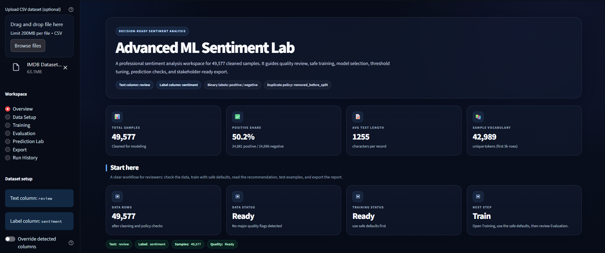
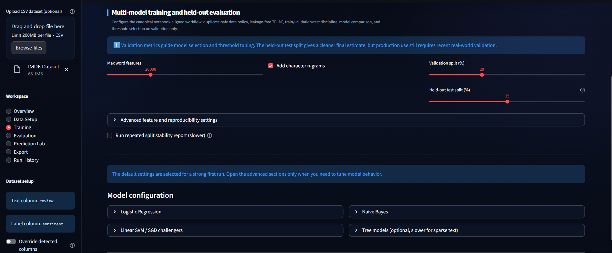
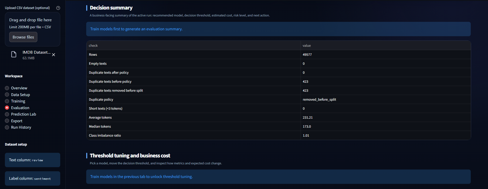

# Advanced ML Sentiment Lab

[](https://github.com/tarekmasryo/advanced-ml-sentiment-lab/actions/workflows/ci.yml)
[](https://streamlit.io/)
[](LICENSE)
[](https://github.com/tarekmasryo)

**Advanced ML Sentiment Lab** is a Streamlit and Plotly application for English IMDB-style sentiment analysis and binary text-classification review workflows.

It turns a modeling workflow into a structured ML review lab: load data, validate quality, train leakage-safe models, tune decision thresholds, inspect mistakes, test predictions, and export review-ready artifacts.

---

## ✨ Highlights

- Single fixed workflow with sidebar navigation.
- Automatic text and label column detection with manual override.
- English-oriented preprocessing for IMDB-style review datasets.
- Duplicate-aware data policy before train/validation/test splitting.
- Leakage-safe TF-IDF fitting on training text only.
- TF-IDF word n-grams with optional character n-grams.
- Classical ML baselines and challengers, including linear models, Naive Bayes, and tree-based models.
- Optional calibration for supported models.
- Validation-based threshold tuning with FP/FN cost controls.
- Optional held-out test estimate.
- Error review for confident false positives and false negatives.
- Linear-model explainability for supported estimators.
- Threshold-aware live prediction instead of a fixed `0.5` cutoff.
- HTML report, model card, metrics CSVs, metadata, and review bundle export.
- Local artifact manifest hashing before automatic artifact reload.

---

## 🧭 Workflow

```text
Overview
→ Data Setup
→ Training
→ Evaluation
→ Prediction Lab
→ Export
→ Run History
```

| Stage | Purpose |
|---|---|
| **Overview** | Review dataset status, detected columns, training state, and the next recommended action. |
| **Data Setup** | Inspect class balance, duplicate policy, empty text, short text, and quality warnings before modeling. |
| **Training** | Train leakage-safe models with configurable TF-IDF features, calibration, validation split, held-out test split, and runtime parallelism. |
| **Evaluation** | Compare models, review threshold recommendations, inspect metrics, confusion matrices, confident mistakes, and explanations. |
| **Prediction Lab** | Score new text using the selected model and the recommended decision threshold. |
| **Export** | Download reports, summaries, metadata, CSV outputs, and a stakeholder review bundle. |
| **Run History** | Browse recent local training runs saved under the configured artifacts directory. |

---

## 📄 Dataset format

The app expects a CSV with:

- A **text column**, such as `review`, `text`, or `comment`.
- A **binary label column**, such as `sentiment`, `label`, or `target`.

The positive and negative label values can be auto-detected for common datasets or selected manually in the app.

This project works well with the [IMDB 50K Reviews dataset](https://www.kaggle.com/datasets/lakshmi25npathi/imdb-dataset-of-50k-movie-reviews).

### Supported local filenames

If no file is uploaded from the sidebar, the app checks common local filenames such as:

```text
IMDB Dataset.csv
imdb.csv
reviews.csv
data.csv
comments.csv
```

Place the dataset next to `app.py`, put it inside `data/`, or upload it directly from the app sidebar.

---

## 🤖 Model families

The lab focuses on strong, interpretable classical ML baselines for text classification:

- Logistic Regression.
- Linear SVM / SGD-style linear classifiers where supported.
- Multinomial Naive Bayes.
- Random Forest.
- Gradient Boosting or other tree-based challengers.

The goal is not to replace transformer-based NLP systems. The goal is to provide a fast, inspectable, leakage-safe baseline workflow with threshold tuning and review-ready exports.

---

## 🖼️ Dashboard Preview

### Overview



### Exploratory Data Analysis



### Evaluation



---

## 🧱 Project structure

```text
app.py
sentiment_lab/
  app/
    main.py
    navigation.py
    components.py
    runtime.py
  artifacts.py
  data_quality.py
  decision.py
  evaluation.py
  explainability.py
  features.py
  io.py
  prediction.py
  preprocessing.py
  reporting.py
  runtime_config.py
  stability.py
  thresholding.py
  training.py
  ui_theme.py
  ux.py
tests/
assets/
```

`app.py` is intentionally small. The reusable ML, reporting, prediction, and runtime logic lives inside `sentiment_lab`, so it can be tested independently from the Streamlit entrypoint.

---

## ⚙️ Local setup

Use **Python 3.11**.

Create and activate a virtual environment:

```bash
python -m venv .venv
```

On Windows PowerShell:

```powershell
.\.venv\Scripts\Activate.ps1
```

Install dependencies:

```powershell
python -m pip install -r requirements-dev.txt
```

Run the app:

```powershell
python -m streamlit run app.py
```

---

## ✅ Quality checks

```powershell
python -m ruff check .
python -m ruff format --check .
python -m pytest -q
```

Optional pre-commit check:

```powershell
pre-commit run -a
```

---

## 🐳 Docker

Build the runtime image:

```bash
docker build --target runtime -t advanced-ml-sentiment-lab:runtime .
```

Run the app:

```bash
docker run --rm -p 8501:8501 advanced-ml-sentiment-lab:runtime
```

Open:

```text
http://localhost:8501
```

---

## 🔧 Runtime configuration

| Variable | Default | Purpose |
|---|---:|---|
| `ARTIFACTS_DIR` | `./artifacts` | Local output directory for model artifacts and run history. |
| `SENTIMENT_LAB_N_JOBS` | `1` | Default training parallelism for supported models. |
| `HOST` | `0.0.0.0` | Docker host binding. |
| `PORT` | `8501` | Streamlit port. |
| `APP_FILE` | `app.py` | Streamlit entrypoint. |

Use `SENTIMENT_LAB_N_JOBS=1` for stable local and CI behavior. Use higher values only when the machine can handle parallel training reliably.

---

## 🔐 Artifact safety

The app uses `joblib` for local scikit-learn artifacts. Treat these files as trusted local outputs only.

Do not load `.joblib` files from unknown users or external sources.

Generated local artifacts include `artifact_manifest.json`, and the app verifies hashes before automatic reload.

The stakeholder review bundle intentionally excludes `.joblib` model binaries. It contains reports, summaries, metadata, and CSV outputs for review.

---

## 📌 Evaluation scope

The default preprocessing is intentionally English-oriented and tuned for IMDB-style review text.

Internal validation and held-out test results are useful for development decisions, but real deployment requires:

- recent representative data,
- external validation,
- monitoring,
- drift checks,
- security review,
- operational ownership.

---

## 📄 License

Apache License 2.0. See [LICENSE](LICENSE).
